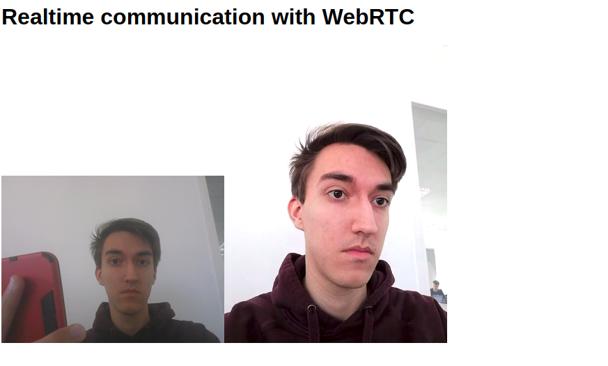

Web Real-Time Communication
============

Histore
-----------------

Un des derniers grands défis pour le web est de permettre la
communication des personnes par la voix et la vidéo:
la communication en temps réel.

Historiquement, faire de la communication en temps réel était
complexe et nécessitait des technologies propriétaires et
coûteuses ou développées en silos.

Du coup, intégrer des technologies RTC avec du contenu préexistant c'était assez
galère, spécialement sur le web.

C'est pour cela que Google mit en place le projet "WEBRTC", qui est utilisé sur des applications telles que Skype.

Le fil rouge du projet WebRTC est que ses APIs doivent être
open-source, libres, standardisées, inclues dans les navigateur
et plus efficaces que l'état de l'art.

Première Page
-----------------

#### getUserMedia()

Avec `getUserMedia`, on peut accéder à la webcam et au microphone sans aucun plugin.
L'accès camera se fait donc directement depuis le navigateur.

La détection de la camera se fait une simple vérification de l'existence de `navigator.mediaDevices.getUserMedia`

```Javascript
function hasGetUserMedia() {
  return !!(navigator.mediaDevices &&
    navigator.mediaDevices.getUserMedia);
}
if (hasGetUserMedia()) {
  // Good to go!
} else {
  alert('getUserMedia() is not supported by your browser');
}
```
>*Le code tel qu'il est actuellement ne fonctionne évidement pas, il vous sert juste à mieux comprendre ce que fait* `getUserMedia()`

#### Contraintes

Une fois le paramètre précédent compris, on va voir les contraintes.
Les `Constraints` ne sont pas quelque chose de difficile, on lui passe juste les paramètres que l'on veut implémenter.

On peut dans notre cas mettre le paramètre **video** avec sa **taille**.

```Javascript
// Constraints HD
const hdConstraints = {
  video: {width: {min: 1280}, height: {min: 720}}
};
// Constraints SD
const sdConstraints = {
  video: {width: {min: 640}, height: {min: 480}}
};
```
>*On verra dans le point suivant comment faire fonctionner cela.*

>*Je vous passe aussi une lien pour voir toutes les contraintes possibles:
https://developer.mozilla.org/en-US/docs/Web/API/Media_Streams_API/Constraints*

#### Tout en un

Maintenant que vous connaissez les deux paramètres, voici le code pas si compliqué que l'on peut mettre en place:

```Javascript
// Constraints
const hdConstraints = {
  video: {width: {min: 1280}, height: {min: 720}}
};
const vgaConstraints = {
  video: {width: {min: 640}, height: {min: 480}}
};
// Access to device
var video = document.querySelector('video');

navigator.mediaDevices.getUserMedia(hdConstraints).then((stream) => {
    video.srcObject = stream
});
```
>*Remarquez qu'il n'y a pas de gestion d'erreur, mais je vous laisse faire la votre à votre guise.*

Pour en arriver à ce résultat:
-   On attrape donc la balise **video** de l'HTML.
-	On Fait l'appel de `getUserMedia()` avec les **contraintes**
-	On *CATCH*  le retour de la fonction qui est notre *flux vidéo*
-	Puis on assigne ce **flux** a notre source de la balise HTML *vidéo*


#### Peer to peer

Maintenant que connaissez le concept de base du Webrtc, et surtout comment on utilise notre caméra, on va utiliser une fonction intégré au projet Webrtc afin d'avoir une connexion **peer to peer** avec d'autres utilisateurs, `RTCMultiConnection()`.

Afin d'utiliser cette fonction, il faut au préalable avoir accès à un serveur TURN (Traversal Using Relays around NAT) que vous pouvez acheter, créer ou bien accéder à un qui soit gratuit.

*Je vous conseille évidement les deux premiers choix pour avoir de meilleures performances. Mais on utilisera un serveur gratuit dans cet exemple.*

Une fois ceci en votre possession, on peut faire le code suivant:

```Javascript
var connection = new RTCMultiConnection();

// this line is VERY important
connection.socketURL = 'https://rtcmulticonnection.herokuapp.com:443/';
```
>*On créer donc une connexion, puis on se connecte a notre serveur.*

Ensuite on va mettre les contraintes pour notre propre vidéo, et les contraintes pour la vidéo que l'on reçoit, puis utiliser `getUserMedia()` qui est inclut dans `onstream`:

```Javascript
// Constraints for my vidéo
connection.session = {
    audio: true,
    video: true
};

//Constraints for the video that i want to watch
connection.sdpConstraints.mandatory = {
    OfferToReceiveAudio: true,
    OfferToReceiveVideo: true
};
//getUserMedia() is in that
connection.onstream = function(event) {
    document.body.appendChild(event.mediaElement);
};
```
>*Remarquez la similarité avec les contraintes vues dans le point précédent.
On peut aussi mettre les mêmes options que sur les contraintes de base.*

Grâce à ces contraintes, on peut facilement que envoyer ou que recevoir une vidéo, un son ou autre, ce qui nous permet de faire du live vidéo, du "Skype", ou même une radio.

Dans notre cas, on va faire du "Skype", pour mieux visualiser le résulat.

&nbsp;

Il nous reste donc un dernier point pour finir notre petit test de **peer to peer**.
Ce sont les **rooms**.

Les **rooms** nous permettent d'aller dans différents "espaces" pour avoir différentes discussion. Cela est assez primordial sinon tout le monde se connecterait avec tout le monde, ce qui n'est pas très pratique.

Suivez donc le code suivant:
```Javascript
var predefinedRoomId = prompt('Please enter room-id', 'room1');

connection.openOrJoin(predefinedRoomId);
```
>*on ouvre donc une petite console ou nous pouvons rentrer le nom que l'on souhaite (room1 est défini par défaut).
Ensuite on crée la room ou on la rejoins avec `openOrJoin`.*

on arrive donc a entrer dans notre room puis à voir deux personnes qui se connectent en mẽme temps:

&nbsp;

&nbsp;
&nbsp;
&nbsp;


